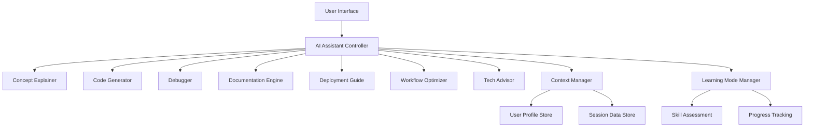

# Design Document: AI Learning Assistant

## Overview

The AI Learning Assistant is a comprehensive system that provides intelligent assistance across multiple domains including concept explanation, code generation, debugging, documentation creation, and workflow optimization. The system is designed as a modular architecture with specialized components that work together to deliver personalized learning and productivity experiences.

The system operates through a central orchestration layer that coordinates between specialized AI components, each optimized for specific tasks. The architecture supports adaptive behavior based on user skill level, context awareness across sessions, and seamless integration between different assistance modes.

## Architecture

The system follows a microservices-inspired architecture with the following key principles:

- **Component Specialization**: Each major capability (code generation, debugging, documentation, etc.) is handled by a dedicated component
- **Central Orchestration**: A main controller coordinates between components and maintains session context
- **Adaptive Interface**: The system adapts its communication style and depth based on user expertise and learning mode
- **Context Preservation**: User context, preferences, and learning progress are maintained across interactions
- **Extensible Design**: New assistance capabilities can be added as additional components

### High-Level Architecture Diagram



## Components and Interfaces

### AI Assistant Controller

The central orchestration component that manages user interactions and coordinates between specialized components.

**Key Responsibilities:**
- Route user requests to appropriate specialized components
- Maintain conversation context and user session state
- Coordinate multi-component responses for complex queries
- Manage learning mode activation and skill level adaptation
- Ensure response consistency across different components

**Interface:**
```typescript
interface AIAssistantController {
  processUserRequest(request: UserRequest): Promise<AssistantResponse>
  setLearningMode(enabled: boolean, skillLevel?: SkillLevel): void
  getSessionContext(): SessionContext
  updateUserProfile(updates: UserProfileUpdates): void
}

interface UserRequest {
  message: string
  requestType: RequestType
  context?: RequestContext
  attachments?: FileAttachment[]
}

interface AssistantResponse {
  message: string
  responseType: ResponseType
  suggestions?: string[]
  followUpQuestions?: string[]
  codeExamples?: CodeExample[]
  resources?: Resource[]
}
```

### Concept Explainer

Specialized component for breaking down complex technical concepts into understandable explanations.

**Key Responsibilities:**
- Analyze technical concepts and identify complexity levels
- Generate explanations appropriate for user skill level
- Provide real-world examples and analogies
- Identify and explain prerequisite knowledge
- Adapt explanation style based on user feedback

**Interface:**
```typescript
interface ConceptExplainer {
  explainConcept(concept: string, skillLevel: SkillLevel): Promise<ConceptExplanation>
  provideExample(concept: string, exampleType: ExampleType): Promise<ConceptExample>
  identifyPrerequisites(concept: string): Promise<string[]>
  adaptExplanation(originalExplanation: ConceptExplanation, feedback: UserFeedback): Promise<ConceptExplanation>
}

interface ConceptExplanation {
  concept: string
  explanation: string
  examples: ConceptExample[]
  prerequisites: string[]
  relatedConcepts: string[]
  difficultyLevel: DifficultyLevel
}
```

### Code Generator

Component responsible for generating high-quality, production-ready code based on user requirements.

**Key Responsibilities:**
- Parse user requirements and generate appropriate code
- Follow language-specific best practices and coding standards
- Include proper error handling and security considerations
- Generate comprehensive inline documentation
- Validate code quality and production readiness

**Interface:**
```typescript
interface CodeGenerator {
  generateCode(requirements: CodeRequirements): Promise<GeneratedCode>
  validateCode(code: string, language: ProgrammingLanguage): Promise<CodeValidation>
  optimizeCode(code: string, optimizationGoals: OptimizationGoal[]): Promise<OptimizedCode>
  generateTests(code: string, testType: TestType): Promise<GeneratedTests>
}

interface CodeRequirements {
  description: string
  language: ProgrammingLanguage
  framework?: string
  constraints?: CodeConstraint[]
  qualityRequirements: QualityRequirement[]
}

interface GeneratedCode {
  code: string
  explanation: string
  dependencies: Dependency[]
  usage: UsageExample[]
  tests?: GeneratedTests
}
```

### Debugger

Component that analyzes code issues and provides comprehensive debugging assistance.

**Key Responsibilities:**
- Analyze error messages and stack traces
- Identify root causes of issues
- Provide step-by-step debugging guidance
- Suggest multiple solution approaches with trade-offs
- Offer preventive measures for similar issues

**Interface:**
```typescript
interface Debugger {
  analyzeError(error: ErrorInfo, code?: string): Promise<DebugAnalysis>
  identifyRootCause(symptoms: ProblemSymptom[]): Promise<RootCauseAnalysis>
  suggestSolutions(analysis: DebugAnalysis): Promise<Solution[]>
  generatePreventiveMeasures(rootCause: RootCause): Promise<PreventiveMeasure[]>
}

interface ErrorInfo {
  errorMessage: string
  stackTrace?: string
  errorType: ErrorType
  context: ExecutionContext
}

interface DebugAnalysis {
  rootCause: RootCause
  affectedComponents: string[]
  severity: SeverityLevel
  solutions: Solution[]
  preventiveMeasures: PreventiveMeasure[]
}
```

### Documentation Engine

Component for creating comprehensive technical documentation from code and project information.

**Key Responsibilities:**
- Analyze code structure and extract documentation elements
- Generate API documentation with usage examples
- Create project-level documentation including setup and architecture
- Format documentation according to standard conventions
- Maintain documentation consistency across projects

**Interface:**
```typescript
interface DocumentationEngine {
  generateAPIDocumentation(code: string, language: ProgrammingLanguage): Promise<APIDocumentation>
  createProjectDocumentation(projectInfo: ProjectInfo): Promise<ProjectDocumentation>
  generateUsageExamples(apiElement: APIElement): Promise<UsageExample[]>
  formatDocumentation(content: DocumentationContent, format: DocumentationFormat): Promise<FormattedDocumentation>
}

interface APIDocumentation {
  overview: string
  endpoints?: EndpointDocumentation[]
  functions?: FunctionDocumentation[]
  classes?: ClassDocumentation[]
  examples: UsageExample[]
}

interface ProjectDocumentation {
  overview: string
  architecture: ArchitectureDescription
  setup: SetupInstructions
  usage: UsageGuide
  api: APIDocumentation
  deployment?: DeploymentGuide
}
```

### Deployment Guide

Component that provides cloud deployment guidance and best practices.

**Key Responsibilities:**
- Assess application requirements for deployment planning
- Recommend appropriate cloud platforms and services
- Generate deployment configurations and scripts
- Provide security and cost optimization guidance
- Offer troubleshooting support for deployment issues

**Interface:**
```typescript
interface DeploymentGuide {
  assessDeploymentRequirements(application: ApplicationInfo): Promise<DeploymentAssessment>
  recommendPlatform(requirements: DeploymentRequirements): Promise<PlatformRecommendation[]>
  generateDeploymentConfig(platform: CloudPlatform, application: ApplicationInfo): Promise<DeploymentConfiguration>
  optimizeForCost(deployment: DeploymentConfiguration): Promise<CostOptimization>
  troubleshootDeployment(issue: DeploymentIssue): Promise<TroubleshootingGuide>
}

interface DeploymentAssessment {
  applicationType: ApplicationType
  scalingRequirements: ScalingRequirements
  securityRequirements: SecurityRequirement[]
  performanceRequirements: PerformanceRequirement[]
  budgetConstraints?: BudgetConstraint[]
}
```

### Workflow Optimizer

Component that analyzes and improves user development workflows and productivity.

**Key Responsibilities:**
- Analyze current workflow patterns and identify inefficiencies
- Recommend tools and practices for productivity improvement
- Provide implementation guidance for workflow changes
- Track and measure productivity improvements
- Suggest automation opportunities

**Interface:**
```typescript
interface WorkflowOptimizer {
  analyzeWorkflow(workflowDescription: WorkflowDescription): Promise<WorkflowAnalysis>
  identifyBottlenecks(workflow: WorkflowDescription): Promise<Bottleneck[]>
  recommendImprovements(analysis: WorkflowAnalysis): Promise<WorkflowImprovement[]>
  generateImplementationPlan(improvements: WorkflowImprovement[]): Promise<ImplementationPlan>
  measureProductivityImpact(baseline: ProductivityMetrics, current: ProductivityMetrics): Promise<ImpactAnalysis>
}

interface WorkflowAnalysis {
  currentEfficiency: EfficiencyScore
  bottlenecks: Bottleneck[]
  strengths: WorkflowStrength[]
  improvementOpportunities: ImprovementOpportunity[]
}
```

### Tech Advisor

Component that provides guidance on technology choices and architecture decisions.

**Key Responsibilities:**
- Assess project requirements and technical constraints
- Compare and recommend technologies and frameworks
- Provide architecture pattern guidance
- Consider long-term implications of technical decisions
- Offer objective analysis with reasoning and justification

**Interface:**
```typescript
interface TechAdvisor {
  assessProjectRequirements(project: ProjectRequirements): Promise<TechnicalAssessment>
  compareTechnologies(options: TechnologyOption[], criteria: SelectionCriteria[]): Promise<TechnologyComparison>
  recommendArchitecture(requirements: ArchitectureRequirements): Promise<ArchitectureRecommendation>
  evaluateLongTermImplications(decision: TechnicalDecision): Promise<ImplicationAnalysis>
}

interface TechnologyComparison {
  options: TechnologyOption[]
  comparison: ComparisonMatrix
  recommendation: TechnologyRecommendation
  reasoning: string
}
```

## Data Models

### User Profile and Context

```typescript
interface UserProfile {
  userId: string
  skillLevel: SkillLevel
  preferredLanguages: ProgrammingLanguage[]
  learningGoals: LearningGoal[]
  experienceAreas: ExperienceArea[]
  communicationPreferences: CommunicationPreference[]
  progressHistory: LearningProgress[]
}

interface SessionContext {
  sessionId: string
  userId: string
  currentTopic?: string
  learningModeActive: boolean
  conversationHistory: ConversationEntry[]
  activeProjects: ProjectContext[]
  recentQueries: QueryHistory[]
}

interface ConversationEntry {
  timestamp: Date
  userMessage: string
  assistantResponse: AssistantResponse
  feedback?: UserFeedback
  followUpActions?: FollowUpAction[]
}
```

### Learning and Skill Management

```typescript
interface SkillLevel {
  overall: ExpertiseLevel
  domains: Map<TechnicalDomain, ExpertiseLevel>
  certifications?: Certification[]
  yearsExperience?: number
}

interface LearningProgress {
  topic: string
  startDate: Date
  currentLevel: ExpertiseLevel
  targetLevel: ExpertiseLevel
  milestones: LearningMilestone[]
  assessments: SkillAssessment[]
}

interface LearningMilestone {
  description: string
  completed: boolean
  completionDate?: Date
  evidence?: string[]
}

enum ExpertiseLevel {
  BEGINNER = "beginner",
  INTERMEDIATE = "intermediate", 
  ADVANCED = "advanced",
  EXPERT = "expert"
}
```

### Code and Project Models

```typescript
interface ProjectContext {
  projectId: string
  name: string
  description: string
  technologies: Technology[]
  architecture: ArchitecturePattern
  codebase?: CodebaseInfo
  deploymentInfo?: DeploymentInfo
}

interface CodebaseInfo {
  language: ProgrammingLanguage
  framework?: string
  structure: ProjectStructure
  dependencies: Dependency[]
  testCoverage?: TestCoverageInfo
}

interface Technology {
  name: string
  category: TechnologyCategory
  version?: string
  purpose: string
  alternatives?: Technology[]
}
```

### Request and Response Models

```typescript
interface RequestContext {
  projectContext?: ProjectContext
  codeContext?: CodeContext
  learningContext?: LearningContext
  urgencyLevel?: UrgencyLevel
}

interface CodeContext {
  currentFile?: string
  selectedCode?: string
  relatedFiles?: string[]
  errorMessages?: string[]
}

interface LearningContext {
  currentTopic?: string
  difficultyLevel?: DifficultyLevel
  learningObjective?: string
  timeConstraints?: TimeConstraint
}
```

## Correctness Properties

*A property is a characteristic or behavior that should hold true across all valid executions of a system—essentially, a formal statement about what the system should do. Properties serve as the bridge between human-readable specifications and machine-verifiable correctness guarantees.*

Based on the prework analysis and property reflection to eliminate redundancy, the following properties capture the essential correctness requirements:

### Property 1: Explanation Quality and Adaptation
*For any* technical concept and user skill level, explanations should use appropriate language complexity, include real-world examples, and adapt terminology to match the user's expertise level.
**Validates: Requirements 1.1, 1.2, 8.1, 8.2**

### Property 2: Prerequisite Knowledge Ordering
*For any* concept with prerequisites, the explanation should identify and explain prerequisite knowledge before explaining the main concept.
**Validates: Requirements 1.3**

### Property 3: Adaptive Response to User Feedback
*For any* user confusion signal or understanding demonstration, the system should adapt subsequent explanations appropriately (simplifying for confusion, advancing for understanding).
**Validates: Requirements 1.4, 8.3, 8.4, 10.5**

### Property 4: Code Generation Quality
*For any* code requirements, the generated code should be syntactically correct, follow best practices, include error handling, contain explanatory comments for complex logic, and meet production security standards.
**Validates: Requirements 2.1, 2.2, 2.3, 2.4, 2.5**

### Property 5: Debugging Analysis Completeness
*For any* error report, the debugging analysis should identify root causes, provide solution explanations, present alternatives with trade-offs when multiple solutions exist, and include preventive measures.
**Validates: Requirements 3.1, 3.2, 3.3, 3.4, 3.5**

### Property 6: Documentation Completeness
*For any* code or project documentation request, the output should include all required elements (API descriptions, usage examples, parameter details, setup instructions) formatted according to standard conventions.
**Validates: Requirements 4.1, 4.2, 4.3, 4.4, 4.5**

### Property 7: Deployment Guidance Comprehensiveness
*For any* deployment request, the guidance should include application assessment, security best practices, platform comparisons when applicable, troubleshooting support, and cost optimization recommendations.
**Validates: Requirements 5.1, 5.2, 5.3, 5.4, 5.5**

### Property 8: Workflow Optimization Specificity
*For any* workflow description, the optimization should identify specific inefficiencies, suggest concrete tools and practices, explain expected benefits, prioritize by impact, and provide implementation guidance.
**Validates: Requirements 6.1, 6.2, 6.3, 6.4, 6.5**

### Property 9: Technology Advisory Objectivity
*For any* technology decision request, the advice should assess requirements, provide objective comparisons, consider scalability/maintainability/expertise factors, highlight long-term implications, and include reasoning for all recommendations.
**Validates: Requirements 7.1, 7.2, 7.3, 7.4, 7.5**

### Property 10: Learning Mode Prioritization
*For any* interaction when learning mode is active, responses should prioritize educational value over efficiency and adapt to the user's indicated skill level.
**Validates: Requirements 8.5**

### Property 11: Cross-Domain Integration
*For any* multi-domain question, the response should provide integrated guidance across all relevant areas, explain concept connections, resolve conflicting best practices with trade-offs, and maintain consistency within project contexts.
**Validates: Requirements 9.1, 9.2, 9.3, 9.4, 9.5**

### Property 12: Interactive Learning Support
*For any* learning interaction, the system should provide understanding tests, give constructive feedback on user attempts, explain errors with guidance, and suggest progression paths after mastery demonstration.
**Validates: Requirements 10.1, 10.2, 10.3, 10.4**

## Error Handling

The system implements comprehensive error handling across all components:

### Input Validation and Sanitization
- All user inputs are validated and sanitized before processing
- Malformed requests are handled gracefully with helpful error messages
- File uploads are scanned for security threats and size limits
- Code inputs are parsed and validated before analysis

### Component-Level Error Handling
- Each specialized component implements circuit breaker patterns for external dependencies
- Fallback mechanisms provide degraded functionality when components are unavailable
- Error propagation includes context and suggested recovery actions
- Timeout handling prevents resource exhaustion from long-running operations

### User Experience Error Handling
- Clear, actionable error messages are provided to users
- Partial results are returned when possible despite errors
- Error recovery suggestions are included in error responses
- System status and component availability are communicated transparently

### Data Consistency and Recovery
- Session state is persisted and recoverable across system restarts
- User profiles and learning progress are backed up and versioned
- Transactional operations ensure data consistency
- Automatic retry mechanisms handle transient failures

## Testing Strategy

The AI Learning Assistant employs a comprehensive dual testing approach combining unit tests for specific scenarios and property-based tests for universal correctness validation.

### Property-Based Testing
Property-based tests validate the universal properties defined above using generated inputs to ensure correctness across all possible scenarios. Each property test will:

- Run a minimum of 100 iterations with randomized inputs
- Use appropriate generators for technical concepts, code requirements, error scenarios, etc.
- Include edge case generators for boundary conditions
- Tag tests with format: **Feature: ai-learning-assistant, Property {number}: {property_text}**

**Property Test Configuration:**
- **Testing Framework:** Hypothesis (Python) or fast-check (TypeScript) for property-based testing
- **Minimum Iterations:** 100 per property test
- **Input Generators:** Custom generators for technical concepts, code requirements, user skill levels, error scenarios
- **Assertion Libraries:** Component-specific assertion helpers for validating explanation quality, code correctness, documentation completeness

### Unit Testing
Unit tests complement property tests by focusing on:

- **Specific Examples:** Concrete scenarios that demonstrate correct behavior
- **Edge Cases:** Boundary conditions and corner cases not easily generated
- **Integration Points:** Component interactions and data flow validation
- **Error Conditions:** Specific error scenarios and recovery mechanisms

**Unit Test Focus Areas:**
- Component initialization and configuration
- API contract validation between components
- User profile and session management
- Learning progress tracking and adaptation
- Security validation and input sanitization

### Integration Testing
- End-to-end workflow testing across multiple components
- User session lifecycle testing
- Learning mode activation and skill level adaptation
- Cross-domain question handling and response coordination
- Performance testing under various load conditions

### Test Data Management
- Synthetic test data generation for various technical domains
- User profile test fixtures covering different skill levels and experience areas
- Code sample libraries for testing code generation and documentation components
- Error scenario databases for debugging component testing

The testing strategy ensures both correctness (through property tests) and reliability (through unit and integration tests), providing comprehensive validation of the AI Learning Assistant's capabilities across all supported use cases.